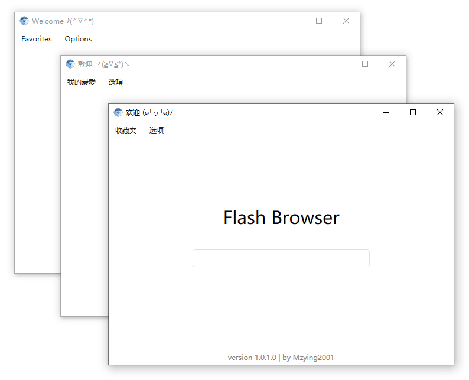
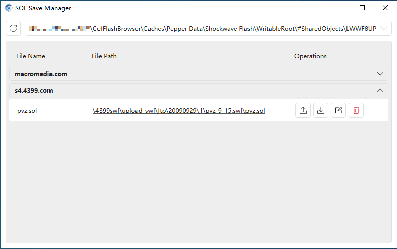
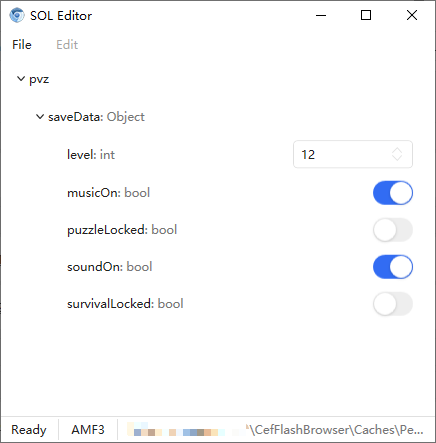

<h1 align="center">
    
     
    CefFlashBrowser
     
    
    
    
</h1>

**中文** | [English](./README.en.md)

## 软件介绍

CefFlashBrowser 是一个自带 Flash Player 插件的浏览器，可以正常显示网页上的 Flash 内容，此外还支持打开本地 SWF 文件，管理 Flash 游戏存档等。

## 下载与使用

在 [Release](https://github.com/Mzying2001/CefFlashBrowser/releases/latest) 下载最新的软件压缩包，解压后双击 `CefFlashBrowser.exe` 即可使用。

> [!NOTE]
> 软件运行依赖 `.NET Framework 4.6.2`，若运行时提示应用程序无法启动，前往[这里](https://dotnet.microsoft.com/zh-cn/download/dotnet-framework/net462)下载安装即可运行。
<!---->
> [!NOTE]
> 若打开软件时提示 `System.IO.FileNotFoundException` 异常，一般是由于缺少 `Microsoft Visual C++ Redistributable` 导致的，前往[这里](https://learn.microsoft.com/zh-cn/cpp/windows/latest-supported-vc-redist#latest-microsoft-visual-c-redistributable-version)下载安装后即可正常打开。

## 存档管理

使用**SOL存档管理器**，可以对游戏存档进行导出、导入、修改等操作。

> [!TIP]
> 建议在修改存档之前先对存档文件进行备份，以防数据丢失。

## Star 趋势

